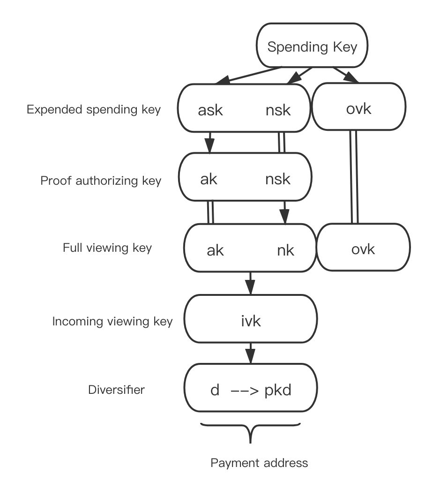

# 实现细节
***
由 `zk-SNARKs` 提供支持，`TRONZ` 实现了基于波场的 TRC20 通证隐私交易，这是少数几种基于账户模型的隐私交易解决方案之一。

本文主要旨在帮助智能合约开发者理解 TRC20 通证隐私交易的设计与实现。

## 背景

目前，区块链行业中的大多数隐私交易解决方案都是使用 `UTXO` 模型构建的，采用了如 `zk-SNARKs `和环签名等技术。例如，`Zcash` 采用 `zk-SNARKs` 技术，而 `Monero` 则使用环签名和 `Bulletproof`。然而，很少有方案采用基于账户模型的隐私交易方案，因为在账户模型中用户的资金是流动的，基于账户余额生成的 `zk-SNARKs` 仅在有限时间内有效，因此实现隐私交易方案极其困难。

2019 年，`Benedikt Bünz` 等人提出了一种面向账户系统的隐私交易方案——`Zether 协议`。`Zether 协议`采用了一种新型的 `zk-SNARKs` 机制 `Σ-Bullets`，能够隐藏转账金额和地址。这项技术在以太坊上进行了部署和测试，但被证明存在缺陷，因为它消耗了过多的 `Gas`。更糟糕的是，每笔交易都必须在一个周期内完成，否则将失败。因此，在网络繁忙时，交易可能由于无法打包或记录在链上而经常失败。

为了保障 TRC20 通证交易中用户的隐私，TRONZ 团队采用 `zk-SNARKs` 实现了 TRC20 通证隐私交易，保护每笔交易的金额和地址的机密性。我们提供了 TRC20 通证隐私交易的标准实现方案，该方案完全兼容标准 TRC20 通证，能够隐藏每笔交易的金额和地址。

## 设计

为了实现 TRC20 通证隐私交易，部署了一个智能合约来接收用户的 TRC20 通证并执行隐私交易。这样，当前基于 UTXO 的隐私交易方案可以用于实现基于账户模型的隐私交易。

我们的隐私交易方案采用了两种账户：公开账户和隐私账户。公开账户就是波场账户。隐私账户类似于 Zcash Sapling 的账户系统。

我们设计了三种隐私交易模式：`MINT`、`TRANSFER` 和 `BURN`。

- **MINT** 指的是从公开地址向隐私地址转移 TRC20 通证。具体而言，TRC20 通证从用户地址转移到合约地址，并将对此隐私输出的承诺添加到智能合约中。
- **TRANSFER** 支持最多 2 个隐私输入到不超过 2 个隐私输出的转移（本质上是多对多转移。在实现层面上我们设置了限制）。在智能合约中确认隐私输入和输出的有效性后，将添加对此隐私输出的承诺。
- **BURN** 支持两种情形，第一种情形是从隐私输入转移到公开地址。另一种情形是从隐私输入转移到公开地址和隐私输出。在智能合约中确认隐私输入和隐私输出的有效性后，一定数量的 TRC20 通证将从合约地址转移到用户的公开地址。对于第二种情形，还将添加隐私输出的承诺。

## 实现

### 隐私账户系统

隐私账户采用与公开账户不同的密钥系统，如下所示。



以下是每个密钥的用途：

- **sk（消费密钥）**：由用户随机生成的32字节位串。它是所有其他密钥派生的核心密钥；
- **ask**：通过对 `sk` 和 `0` 进行 `BLAKE2b` 哈希计算得到的值。用于使用消费权限签名算法生成签署隐私输入的密钥；
- **ak**：通过将椭圆曲线上的一个坐标与 `ask（标量`）相乘返回的值。用于使用消费权限签名算法生成验证隐私输入的公钥；
- **nsk**：通过对 `sk` 和 `1` 进行 `BLAKE2b` 哈希计算得到的值。用于生成 `nk`；
- **nk**：通过 `nsk` 与椭圆曲线上的一个坐标进行标量相乘生成。用于生成消除器（防止双重花费）；
- **ivk**：通过 `ak 和` `nk` 执行 `BLAKE2s` 哈希生成。主要由接收者用于查看其接收到的隐私交易；
- **ovk**：通过 `sk` 和 `2` 执行 `BLAKE2b` 哈希生成。主要由发送者用于查看隐私交易。
- **d（分散器）**：由用户选择的11字节随机数。它是地址的一部分，主要用于生成不同的地址以打破地址与交易之间的关系；
- **pk_d**：是地址的一部分。`d` 会首先执行 `DiversifyHash`（即，将 `d` 哈希到椭圆曲线的坐标）以生成 `g_d`。`g_d` 与 `ivk` 的标量相乘生成 `pk_d`，`(d, pk_d)` 构成隐私地址。

### 隐私交易的理论基础

每个匿名输出都是一个注释。`注释 = (d, pk_d, value, rcm)`。`(d, pk_d)` 是交易地址，`value` 是交易数量，`rcm` 是落在 `Jubjub` 椭圆曲线标量范围内的随机数，即 `rcm < 0xe7db4ea6533afa906673b0101343b00a6682093ccc81082d0970e5ed6f72cb7`。链上提供的 `getrcm` 接口可以随机生成 `rcm`。为了保证交易的匿名性和隐私性，注释不在链上。链上存储的是注释的承诺，称为 `note_commitment`。每次隐私交易成功验证后，`note_commitment` 将存储在 `Merkle` 树的叶子节点。同样，每个匿名输入也是一个注释。

在消费一个注释时，用户需要提供零知识证明以证明其知道正被消费的注释的私密信息。在链上验证证明时，需要公共输入。

- **nf**：每个注释都对应一个唯一的 `nf`，`nf` 和注释在 `Merkle` 树上的位置与 `note_commitment` 相关，用于防止注释的双重消费。
- **anchor**：`Merkle` 树的根。
- **value_commitment**：对注释数量的承诺。
- **rk**：验证注释的消费权限签名的公钥。

用户可以通过验证证明来消费特定的注释，但其他人无法知道 `Merkle` 树上正被消费的是哪个注释，这意味着他们无法知道交易的具体数量和地址。因此，可以保护发送者的隐私和匿名性。

除了验证证明外，还需要提供消费权限签名以完成每个匿名输入的链上验证。

在执行交易时，每个隐私输出也需要零知识证明，以确保用户知道交易的数量和接收者的地址。在验证证明时，需要以下公共输入：

- **note_commitment**：对注释的承诺
- **value_commitment**：对注释数量的承诺
- **epk**：用于解密注释的临时公钥

验证证明确认接收者的地址和交易数量，这些信息除了发送者和接收者外无人知晓。因此可以保证接收者的隐私和匿名性。

每个隐私输出需要额外的密文字段 `C_enc` 和 `C_out`，以便发送者和接收者可以从注释中解密信息。

此外，交易的验证需要验证绑定签名，以确保发送者和接收者的交易数量平衡。

有关协议的详细信息，请参阅 [TRONZ 隐私协议](https://www.tronz.io/zh/)。

### 隐私交易的实现

TRC20 通证的隐私交易通过智能合约实现（以下简称为隐私合约）。

在部署隐私合约时，绑定 TRC20 合约地址，以便隐私协议仅适用于 TRC20 通证的隐私交易。

```solidity
constructor (address trc20ContractAddress, uint256 scalingFactorExponent) public {
    require(scalingFactorExponent < 77, "The scalingFactorLogarithm is out of range!");
    scalingFactor = 10 ** scalingFactorExponent;
    owner = msg.sender;
    trc20Token = TokenTRC20(trc20ContractAddress);
}
```

除了 TRC20 合约地址外，还需要在合约中设置 `scalingFactorExponent`，主要用于支持具有更高精度（小数位数）的 TRC20 通证。隐私合约要求转账数量必须是 `scalingFactor` 的倍数。

变量 `frontier` 存储 `Merkle` 树，`leafCount` 表示当前 `Merkle` 树上的节点数量。

```solidity
bytes32[33] frontier;
uint256 public leafCount;
```

#### MINT 交易

MINT 交易将一定数量的 TRC20 通证转移到隐私合约地址，并将隐私输出的 `note_commitment` 添加到隐私合约 `Merkle` 树的一个叶子节点上。

MINT 交易从用户账户向隐私合约账户转移 TRC20 通证，因此在执行 MINT 交易之前，需要调用 TRC20 合约的 `approve(address _spender, uint256 _value)` 函数，以允许将一定数量的 TRC20 通证转移到隐私合约账户。`_spender` 表示隐私合约地址，`_value` 表示转移数量。

```solidity
function mint(uint256 rawValue, bytes32[9] calldata output, bytes32[2] calldata bindingSignature, bytes32[21] calldata c) external {}
```

MINT 交易通过触发隐私合约的 `mint` 函数来执行。函数的参数包括：

- **rawValue**: 转移数量
- **output**: `{note_commitment||value_commitment||epk||proof}`
- **bindingSignature**: 用于验证交易中输入和输出数量平衡的绑定签名
- **c**: `{C_enc||C_out}`，密文字段

在隐私合约中执行以下步骤：

从用户地址向隐私合约地址转移指定数量的 TRC20 通证。

```solidity
bool transferResult = trc20Token.transferFrom(sender, address(this), rawValue);
require(transferResult, "TransferFrom failed!");
```

验证 `zk-SNARKs` 和绑定签名。如果验证成功，通过在叶子节点上添加 `note_commitment` 来更新 `Merkle` 树。此步骤在 `verifyMintProof` 预编译合约中实现，特别为 `zk-SNARKs` 添加。`verifyMintProof` 返回需要更新的 `Merkle` 树的最新根和节点。

```solidity
bytes32 signHash = sha256(abi.encodePacked(address(this), value, output, c));
(bytes32[] memory ret) = verifyMintProof(output, bindingSignature, value, signHash, frontier, leafCount);
uint256 result = uint256(ret[0]);
require(result == 1, "The proof and signature have not been verified by the contract!");
```

`signHash` 是绑定签名的消息哈希。

`verifyMintProof` 返回的 `Merkle` 树的根和节点需要在合约中更新。

```solidity
mapping(bytes32 => bytes32) public roots;
roots[latestRoot] = latestRoot;
```

`roots` 存储 `Merkle` 树的所有历史根。

此外，由于 `tree` 存储完整的 `Merkle` 树，所有更新的 `Merkle` 树节点将同步更新到 `tree`。

```solidity
mapping(uint256 => bytes32) public tree;
```

将 `note_commitment`、`value_commitment`、`epk`、`c` 以及新添加的叶子节点的位置添加到交易日志中。

```solidity
emit NewLeaf(leafCount - 1, output[0], output[1], output[2], c);
```

#### TRANSFER 交易

TRANSFER 交易支持从多个隐私输入到多个隐私输出的转移。一旦交易确认，隐私输出的 `note_commitment` 将被添加到隐私合约 `Merkle` 树的叶子节点上。

TRANSFER 交易通过触发隐私合约的 `transfer` 函数来执行。

```solidity
function transfer(bytes32[10][] calldata input, bytes32[2][] calldata spendAuthoritySignature, bytes32[9][] calldata output, bytes32[2] calldata bindingSignature, bytes32[21][] calldata c) external {}
```

函数的参数包括：

- **input**: `{nf||anchor||value_commitment||rk||proof}`, 可变长度数组。支持多个隐私输入。
- **spendAuthoritySignature**: 隐私输入的认证签名。每个隐私输入都有一个对应的认证签名。
- **output**: `{note_commitment||value_commitment||epk||proof}`, 每个隐私输出有一个对应的输出。
- **bindingSignature**: 用于验证交易中输入和输出数量平衡的绑定签名。
- **c**: `{C_enc||C_out}`, 密文字段。每个隐私输出都有一个对应的 `c`。

在隐私合约中执行以下步骤：

限制隐私输入和输出的数量。为了验证 `zk-SNARKs` 的效率，设置隐私输入和输出数量的上限为 `2`。

```solidity
require(input.length >= 1 && input.length <= 2, "Input number must be 1 or 2!");
require(input.length == spendAuthoritySignature.length, "Input number must be equal to spendAuthoritySignature number!");
require(output.length >= 1 && output.length <= 2, "Output number must be 1 or 2!");
require(output.length == c.length, "Output number must be equal to c number!");
```

验证双重消费和 `Merkle` 根的有效性。

```solidity
for (uint256 i = 0; i < input.length; i++) {
    require(nullifiers[input[i][0]] == 0, "The note has already been spent!");
    require(roots[input[i][1]] != 0, "The anchor must exist!");
}
```

对每个隐私输入验证 `nf` 是否在 `nullifiers` 中。如果结果是否定的，则验证该 `note` 尚未被消费。还需验证 `anchor` 是否存在于 `Merkle` 树的历史根中。

验证 `zk-SNARKs`、隐私输入的认证签名和绑定签名。如果验证成功，通过在叶子节点上添加 `note_commitment` 来更新 `Merkle` 树。此步骤在 `verifyTransferProof` 预编译合约中实现，特别为 `zk-SNARKs` 添加。`verifyTransferProof` 返回需要更新的 `Merkle` 树的最新根和节点。

```solidity
bytes32 signHash = sha256(abi.encodePacked(address(this), input, output, c));
(bytes32[] memory ret) = verifyTransferProof(input, spendAuthoritySignature, output, bindingSignature, signHash, frontier, leafCount);
uint256 result = uint256(ret[0]);
require(result == 1, "The proof and signature have not been verified by the contract!");
```

`verifyTransferProof` 返回的 `Merkle` 树需要更新的根和节点需要在合约中更新。

将每个隐私输入的 `nf` 添加到 `nullifiers` 中，以表示该 `note` 已被消费。

```solidity
for (uint256 i = 0; i < input.length; i++) {
    bytes32 nf = input[i][0];
    nullifiers[nf] = nf;
}
```

将每个隐私输出的 `note_commitment`、`value_commitment`、`epk`、`c` 以及新添加的叶子节点的位置添加到交易日志中。

```solidity
for (uint256 i = 0; i < output.length; i++) {
    emit NewLeaf(leafCount - (output.length - i), output[i][0], output[i][1], output[i][2], c[i]);
}
```

#### BURN 交易

BURN 交易支持从隐私输入到公开地址或同时到公开地址和隐私输出的转移。一旦交易确认，将通过 TRC20 合约的 `transfer` 函数从隐私合约地址向用户的公开地址转移一定数量的 TRC20 通证。在第二种情况下，隐私输出的 `note_commitment` 也将被添加到 `Merkle` 树中。

BURN 交易通过触发隐私合约的 `burn` 函数来执行。

```solidity
function burn(bytes32[10] calldata input, bytes32[2] calldata spendAuthoritySignature, uint256 rawValue, bytes32[2] calldata bindingSignature, address payTo, bytes32[3] calldata burnCipher, bytes32[9][] calldata output, bytes32[21][] calldata c) external {}
```

函数的参数包括：

- **input**: `{nf||anchor||value_commitment||rk||proof}`
- **spendAuthoritySignature**: 隐私输入的认证签名
- **rawValue**: 转移数量
- **bindingSignature**: 用于验证交易中输入和输出数量平衡的绑定签名
- **payTo**: 交易接收方的公开地址
- **burnCipher**: 接收地址和转移数量的加密。加密密钥为发送方的 `ovk`。此参数主要用于交易发送方跟踪其交易历史
- **output**: `{note_commitment||value_commitment||epk||proof}`
- **c**: `{C_enc||C_out}`，密文字段。每个隐私输出都有一个对应的 `c`

根据以下步骤执行函数：

验证 `nf` 和 `anchor`，用来确定隐私输入是否被双重消费以及 `anchor` 是否为 `Merkle` 树的历史根。

```solidity
require(nullifiers[nf] == 0, "The note has already been spent!");
require(roots[anchor] != 0, "The anchor must exist!");
```

根据 `output` 的长度来确定燃烧场景，如果是场景一（从隐私输入转移到公开地址），执行步骤 2.1；如果是场景二（从隐私输入转移到公开地址和隐私输出），执行步骤 2.2。

2.1 对于场景一，验证隐私输入的 `zk-SNARKs`、认证签名和绑定签名。此步骤在 `verifyBurnProof` 预编译合约中实现，并特别为 `zk-SNARKs` 添加。

```solidity
bytes32 signHash = sha256(abi.encodePacked(address(this), input, output, c, payTo, value));
(bool result) = verifyBurnProof(input, spendAuthoritySignature, value, bindingSignature, signHash);
require(result, "The proof and signature have not been verified by the contract!");
```

2.2 对于场景二，验证隐私输入和隐私输出的 `zk-SNARKs`，验证隐私输入的认证签名和绑定签名。此步骤在 `verifyTransferProof` 预编译合约中实现，并特别为 `zk-SNARKs` 添加。

```solidity
bytes32 signHash = sha256(abi.encodePacked(address(this), input, output, c, payTo, value));
(bytes32[] memory ret) = verifyTransferProof(inputs, spendAuthoritySignatures, output, bindingSignature, signHash, value, frontier, leafCount);
uint256 result = uint256(ret[0]);
require(result == 1, "The proof and signature have not been verified by the contract!");
```

`verifyTransferProof` 返回的需要更新的根和节点需要在合约中更新。

将隐私输入的 `nf` 添加到 `nullifiers` 中，以表示该 `note` 已被消费。

```solidity
nullifiers[nf] = nf;
```

调用 TRC20 合约的 `transfer` 函数，从隐私合约地址向用户指定的公开地址转移一定数量的 TRC20 通证。

```solidity
bool transferResult = trc20Token.transfer(payTo, rawValue);
require(transferResult, "Transfer failed!");
```

#### Merkle 路径

在构建隐私输入时，`note` 的私密信息包括 `note_commitment` 的 `Merkle` 路径和 `Merkle` 树根。
为了帮助用户轻松构建 `zk-SNARKs`，隐私合约提供了 `getPath` 方法，用于计算指定位置的叶子节点的 `Merkle` 路径。

```solidity
function getPath(uint256 position) public view returns (bytes32, bytes32[32] memory) {}
```

使用 `getPath` 输入叶子节点的位置。函数将返回 `Merkle` 根和 `Merkle` 路径。

## 参考文献

[1] Zether 协议 https://crypto.stanford.edu/~buenz/papers/zether.pdf

[2] TIP135 https://github.com/tronprotocol/tips/blob/master/tip-135.md

[3] TRONZ 隐私协议 https://www.tronz.io/Shielded%20Transaction%20Protocol.pdf