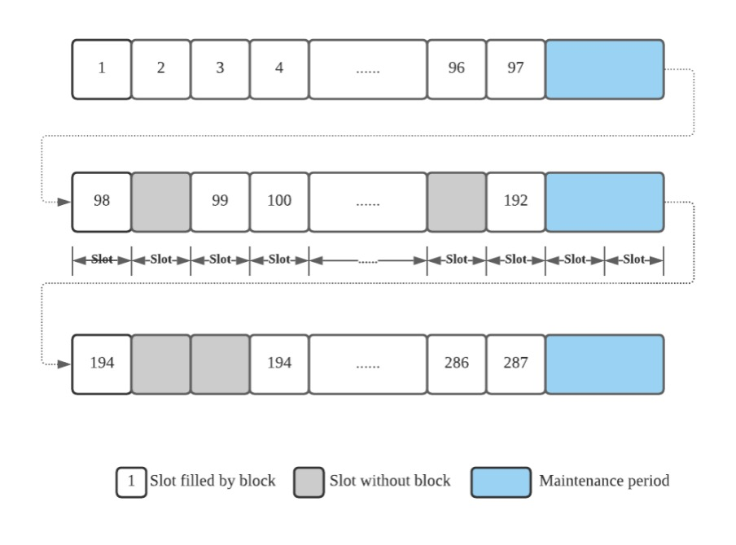
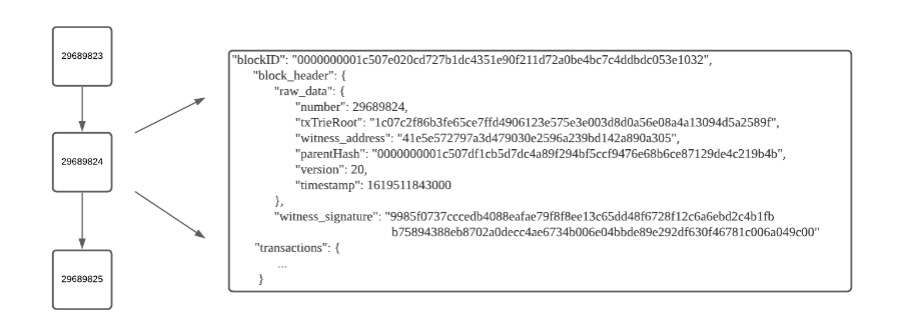
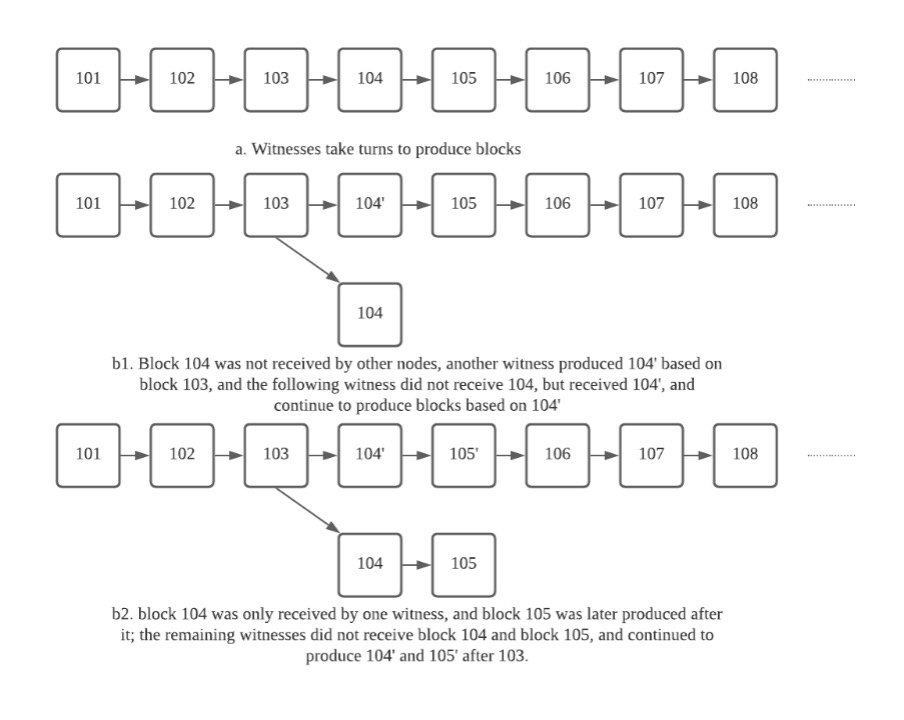
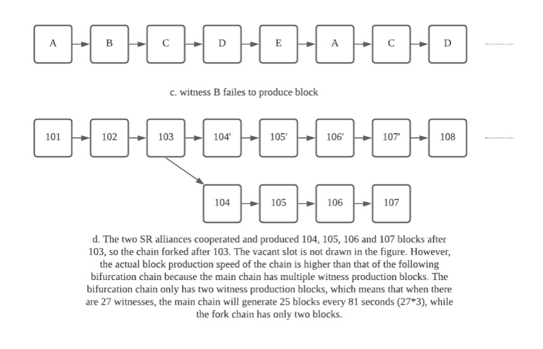

# 共识
***
## 概述
区块链是一种分布式记账系统。区块链系统中可能有成千上万个节点，每个节点都独立存储相同的账本。如果要将新的交易数据写入账本，需要这些节点的批准。在不受信任的分布式环境中实现这一目标是一项复杂的系统性任务。区块链系统的正常运行意味着区块链中的每个节点都能始终保持相同的账本，前提是系统中的大多数节点都是诚实可靠的。为了保证诚实可靠的节点能够共同监督写入账本的交易数据，每个区块链系统都需要建立自己的共识，共识相当于区块链的宪法。只要绝大多数节点都遵守共识要求，就能保证结果无疑是可信的，即使在不信任的分布式环境中也是如此。因此，共识是诚实节点为维护区块链稳定性而达成的协议。

不同的区块链系统会有独特的实现方式。共识有多种类型，最常用的有 POW、POS 和 DPoS。本文将主要介绍 TRON 所基于的 DPoS 共识。我们还将解释 DPoS 的基本组成部分和机制。

## 区块生产过程
区块链网络的见证人收集区块链网络中新产生的交易，并验证这些交易的合法性，然后将这些交易打包成一个区块，记录为分类账上的新页面，并向整个区块链网络广播该页面。接下来，其他节点将收到新页面，验证页面上交易数据的合法性，并将其添加到它们的分类账中。最后，见证人将重复这一过程，以便将区块链系统中的所有新交易数据记录到分类账中。

## DPoS 概述
共识的作用是选择区块链系统中的见证人。见证人验证交易数据，保留账户向网络中的其他节点广播新账户，并获得其他节点对新账户的批准。作为共识的具体实现方式，DPoS 的工作原理如下：

DPoS 共识根据获得的票数选择一些节点作为区块链系统中的见证人。首先，当区块链系统开始运行时，会发行一定数量的代币，然后将代币分发给区块链系统中的节点。然后，节点可以用一部分代币申请成为区块链系统中的候选见证人。区块链系统中任何持有代币的节点都可以为这些候选人投票。每隔 t 个周期，将对所有候选人的投票进行统计。得票最多的前 N 个候选节点将成为下一个 t 期的见证人。t 个周期后，将再次统计选票，选出新的见证人，如此循环往复。

让我们看看《TRON》是如何实现这一点的：

## 定义

- TRON：指 TRON 网络。本文件不区分 TRON、TRON 区块链、TRON 区块链系统等。
- TRON 代币：指 TRON 发行并在 TRON 流通的权益代币，称为 TRX。
- Witnesses：有资格成为 TRON 证人的节点。
- 簿记： 验证交易并将其记录在分类账中的过程。由于 TRON 中的区块携带分类账，记账过程也称为区块生成。在本文件中，我们将不区分簿记和区块生成。
- 记账顺序：区块生成顺序。27 个证人根据得票数降序排列。
- 时隙：在 TRON 中，每三秒为一个时隙。在正常情况下，每个 SR 将在相应的时隙时间内产生一个数据块。因此，TRON 的平均块间隔约为三秒。如果某个 SR 因故未能生成区块，则相应的时隙将空出，下一个 SR 将在下一个时隙生成区块。在维护期间，区块生产将跳过两个时隙。
- 纪元： TRON 将一个 Epoch 设置为 6 小时。一个纪元的最后两个区块时间为维护期，在此期间将决定下一个纪元的区块生成指令。
- 维护周期： TRON 将该周期设定为两个区块时间，即 6 秒。这段时间用于计算候选人的票数。24 小时内有 4 个纪元，自然也就有 4 个维护期。在维护期内，见证人暂停生成区块。下一个纪元的区块生成顺序将在维护期决定。

## 选举机制

1. 投票 - 在 TRON 中，1 TRX 等于一票。
2. 投票程序 - 在 TRON 中，为候选人投票是一种特殊的交易。节点可以通过生成投票事务为候选人投票。
3. 计票 - 在每个维护期内，将对候选人的票数进行统计。得票最多的前 27 名候选人将成为下一个纪元的见证人。

## 区块生成机制
在每个纪元期间，27 位见证人将按照记账顺序轮流生成区块。每个见证人只能在轮到自己时生成区块。见证人将多个已验证交易的数据打包到每个区块中。见证人将用自己的私人密钥签署这个区块的数据，并在区块中填写见证人签名、见证人地址、区块高度、区块生成时间等信息。上一个区块的哈希值将作为父哈希值包含在每个新区块中。

通过存储前一个区块的哈希值，区块在逻辑上相互连接。最终，它们形成了一条链。典型的区块链结构如下图所示：

在理想情况下，基于 DPoS 共识的区块链系统的记账过程按照事先计算好的记账顺序进行。见证人依次生成区块（见图 a）。然而，从以下三个方面来看，区块链网络是一个分布式、不受信任的复杂系统。

- 由于网络环境不佳，一些证人生成的数据块无法在无效时间被其他证人接收（见图 b1 和 b2）。
- 不能总是保证某个证人的正常工作（见图 c）。
- 一些恶意见证者会生成分叉块，以分叉链（见图 d）。

如上所述，区块链系统正常运行的基础是系统中的大部分节点都是诚实可靠的。此外，区块链系统安全的首要保障是账本的安全，即非法数据不能被恶意写入账本，各节点保存的账本副本应保持一致。基于 DPoS 共识，记账过程由见证人执行。因此，TRON 的安全性取决于大多数见证人的可靠性。TRON 在系统中设置了不可逆转的确认区块。同时，为了抵制少数见证节点的恶意行为，TRON 根据 “最长链原则 ”将最长链认定为主链。

**经确认的区块原则**

新制作的区块未经确认。只有那些得到 27 位见证人中 70% 以上（即 27 * 70% = 19，四舍五入）“认可 ”的区块才被视为不可逆转区块，通常被称为固化区块。整个区块链网络已经确认了固化区块中包含的交易。“认可 "未确认状态区块的方式是该见证人在其后产生后续区块。这里需要强调的一点是，产生这 18 个区块的见证人必须与产生第 103 个区块的见证人不同。

**最长链原则**

当发生分叉时，诚实的见证人总是会选择在最长的链上生成区块。

## 奖励模式
TRON 建立了一个激励模式，鼓励节点参与和网络扩展，以确保区块链系统安全高效地运行。完成区块生产任务的见证人将获得 TRX 奖励。该模式还规定，见证人每生产一个确认区块，将获得 32 TRX。此外，在每个纪元的维护期内，得票最多的前 127 位见证人（包括见证人候选人）将获得相应的奖励。

## 基于提案的参数调整
DPoS 的一个显著特点是，任何参数调整都可以在链上提出，见证人将通过发起投票来决定是否批准该提议。这种方法的优点是在添加新功能时避免了硬分叉升级。目前，TRON 网络参数请参考此处或 Tronscan。

## 附录： 参考文件

- Delegated Proof of Stake (DPoS) – Total Beginners Guide
- Consensus Algorithms: Proof-of-Stake & Cryptoeconomics
- Role of Delegates
- What is Delegated Proof of Stake?

