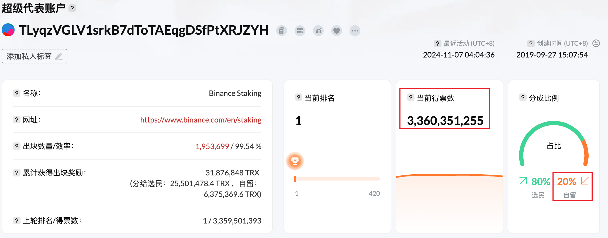
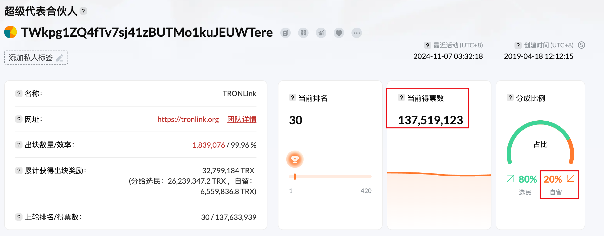

# 超级代表
***
波场网络中的区块生产者，也称为超级代表，通过投票选举产生。
任何账户都可以通过支付 `9999TRX` 申请成为超级代表候选人，然后参与超级代表选举。
任何账户均可投票选出超级代表候选人，得票最多的前27名候选人成为超级代表。
超级代表需要运行波场节点来参与区块生产，并且还将获得区块奖励和投票奖励。
投票给超级代表的选民将获得投票奖励。

排名第 `28` 位至第 `127` 位的超级代表候选人也被称为超级代表合伙人。
超级代表合伙人不参与区块生产和打包交易，但会获得投票奖励。
投票给超级代表合伙人的选民还将获得投票奖励。

## 投票权
在投票选举超级代表之前，任何账户都需要获得投票权，即 `波场权力`（TP）。
投票权可通过质押 TRX 获得。除了获得带宽或能量外，质押 TRX 还可同时获得投票权。
质押 1TRX 的选民将获得 1TP。

账户质押的 TRX 解押后将损失相应数量的 TP，正在进行的投票也将失效。
每 6 小时计票一次，每 6 小时更换一次超级代表和超级代表合伙人。
如果一个账户在计票前已投票多次，波场网络仅记录该账户的最新投票，之前的投票将被覆盖。

## 奖励
TRON 网络中每个区块的生产都会向超级代表和超级代表合作伙伴奖励一定数量的 TRX。
奖励分为以下两部分：

- 区块奖励：随着每个区块的产生，波场网络将奖励 16TRX 给出块的超级代表，超级代表也会根据选民的投票比例扣除佣金比例后将剩余部分分配给选民。
- 投票奖励：随着每个区块的产生，波场网络将奖励 160TRX 给超级代表和超级代表合伙人，超级代表合伙人将按照投票比例瓜分 160TRX。超级代表和超级代表合伙人获得的投票奖励，扣除各自的佣金后，也将按照投票比例分配给选民。

### 超级代表经纪
经纪比例是从超级代表和超级代表合伙人的奖励中扣除的比例。
违约比例为 20%，即选民投票产生的全部奖励，其中 20% 支付给超级代表或超级代表合伙人作为佣金补偿。
超级代表和超级代表合伙人可以通过 `wallet/getBrokerage` 接口查询经纪比例，
也可以通过 `wallet/updateBrokerage` 接口修改经纪比例。

### 区块奖励计算
超级代表每生成一个区块可获得 16 TRX。
TRON 网络每 3 秒钟产生一个区块，因此一天总共产生 460 800 TRX。
27 名超级代表轮流生产区块。
假设超级代表的经纪比例为 20%，则超级代表每天可获得的区块奖励为 3,413 TRX。
计算公式如下：

!!!note ""
    奖励 = 460,800 / 27 * 20%  

超级代表选民一天的奖励是：

!!!note ""
    奖励 = 460 800 / 27 * 80% *（选票/该 SR 获得的选票）

### 投票奖励计算
TRON 每生产一个区块将产生 160 TRX 的投票奖励，一天共计 4,608,000 TRX。
假设超级代表的经纪费率为 20%，则超级代表（SR）或超级代表合伙人（SRP）一天获得的投票奖励为：

!!!note ""
    奖励 = 4 608 000 * SR 或 SRP 获得的票数/所有 SR 和 SRP 的总票数 * 20%

超级代表及超级代表合伙人选民一日投票奖励为：

!!!note ""
    奖励 = 4,608,000 * SR或SRP获得的票数 / 所有SR和SRP的总票数 * 80% *（票数/SR或SRP获得的票数） = 4,608,000 * 票数 / 所有SR和SRP的总票数 * 80%

### 奖励计算示例
下面以超级代表和超级代表伙伴为例，说明用户在一天内可以获得的大致奖励。
假设投票者的投票数为 10,000,000 票，那么在撰写本文时，
前 127 名候选人的总票数为 41,549,848,155 票。

**超级代表投票奖励计算示例**

获得的超级代表如下 3,360,351,255 票，经纪比率为 20%。

那么，超级代表及其选民可以获得的奖励为：

|类型| 区块奖励                                                    | 投票奖励                                                          | 总奖励        |
|---|---------------------------------------------------------|---------------------------------------------------------------|------------|
|超级代表| 460,800 / 27 * 10% = 1,706 TRX	                         | 4,608,000 * 3,360,351,255 / 41,549,848,155 * 20% = 74,534 TRX | 76,240 TRX |
|选民| 460,800 / 27 * 90% * 10,000,000/3,360,351,255 = 45 TRX	 | 4,608,000 * 10,000,000 / 41,549,848,155 * 80% = 887 TRX       | 932 TRX    |

**超级代表合伙人投票奖励计算示例**

以下超级代表合伙人获得票数：137,519,123 票，经纪比例为 20%。

那么，超级代表合伙人及其选民可以获得的奖励为：

|类型| 区块奖励   | 投票奖励                                                        | 总奖励       |
|---|--------|-------------------------------------------------------------|-----------|
|超级代表| 0 TRX	 | 4,608,000 * 137,519,123 / 41,549,848,155 * 20% = 3,050 TRX	 | 3,050 TRX |
|选民| 0 TRX	 | 4,608,000 * 10,000,000 / 41,549,848,155 * 80% = 887 TRX     | 887 TRX   |

## 委员会及提案
TRON 委员会由目前的 27 名超级代表组成，负责维护和修改波场网络的动态参数，
如区块奖励、交易费用等。
每个超级代表、超级代表合伙人和超级代表候选人都有权发起修改波场网络参数的提案，
但只有超级代表拥有投票权。

提案只支持投赞成票，超级代表不投票表示不同意提案。
提案自创建之日起三天内有效。
在提案有效期内，超级代表可以对提案进行投票，也可以取消之前的投票。
如果提案在有效期内获得 18 票或更多超级代表投票，提案将获得通过。
如果提案过了有效期，但没有获得足够的票数，提案将失效。

### 波场网络参数
波场网络可以通过提案修改的动态参数如下：

| 序号   | 参数                                                                                                                | 当前值                   |
|:-----|:------------------------------------------------------------------------------------------------------------------|:----------------------|
| # 0  | 建议修改 SR 的维护间隔                                                                                                     | 6 Hour                |
| # 1  | 建议修改 SR 账户的申请费用                                                                                                   | 9999 TRX              |
| # 2  | 建议修改账户创建费                                                                                                         | 0.1 TRX               |
| # 3  | 建议修改 1 单位带宽的收费标准                                                                                                  | 0.001 TRX             |
| # 4  | 建议修改资产发行费                                                                                                         | 1024 TRX              |
| # 5  | 建议修改 SR 区块生成奖励                                                                                                    | 16 TRX                |
| # 6  | 建议修改前 27 名员工代表和以下 100 名合作伙伴的奖励办法                                                                                  | 115200 TRX            |
| # 7  | 建议修改系统合同中的账户创建成本                                                                                                  | 1 TRX                 |
| # 9  | 建议激活虚拟机（VM）                                                                                                       | 1                     |
| # 10 | Propose to remove the GR Genesis votes                                                                            | 1                     |
| # 11 | Propose to modify the fee of 1 unit of Energy                                                                     | 0.00021 TRX           |
| # 12 | Propose to modify the cost of trading pair creation                                                               | 1024 TRX              |
| # 13 | Propose to modify the maximum execution time of one transaction                                                   | 80 ms                 |
| # 14 | Propose to allow duplicate account name                                                                           | 0                     |
| # 15 | Propose to allow duplicate token name                                                                             | 1                     |
| # 16 | Propose to allow resource delegation                                                                              | 1                     |
| # 18 | Propose to allow the TRC-10 token transfer in smart contracts                                                     | 1                     |
| # 19 | Propose to modify the total Energy limit                                                                          | 180000000000 ENERGY   |
| # 20 | Propose to allow the initiation of multi-signature                                                                | 1                     |
| # 21 | Propose to allow adaptive adjustment for total Energy                                                             | 0                     |
| # 22 | Propose to modify the fee for updating account permission                                                         | 100 TRX               |
| # 23 | Propose to modify the fee for updating multi-signature                                                            | 1 TRX                 |
| # 24 | Propose to enable protocol optimization                                                                           | 0                     |
| # 26 | Propose to support Constantinople Upgrade for TVM                                                                 | 1                     |
| # 29 | Propose to modify the adaptive Energy limit                                                                       | 1000                  |
| # 30 | Propose to support the decentralized vote dividend                                                                | 1                     |
| # 31 | Propose to modify the block voting rewards given to the top 27 SRs and the following 100 partner                  | 160 TRX               |
| # 32 | Propose to allow TVM to support Solidity 0.5.9                                                                    | 1                     |
| # 33 | Propose to modify the adaptive Energy limit target                                                                | 10                    |
| # 35 | Propose to ban transferring TRX and TRC10 tokens to smart contracts via TransferContract or TransferAssetContract | 0                     |
| # 39 | Propose to enable the function of verifying zero-knowledge proof in TVM                                           | 1                     |
| # 40 | Propose to enable PBFT consensus                                                                                  | 0                     |
| # 41 | Propose to enable TVM Istanbul instruction                                                                        | 1                     |
| # 44 | Propose to allow enabling DEX                                                                                     | 0                     |
| # 45 | Propose to modify fees for creating orders on DEX                                                                 | 0 TRX                 |
| # 46 | Propose to modify fees for canceling orders on DEX                                                                | 0 TRX                 |
| # 47 | Proposal to modify the upper limit of the fee of a smart contract                                                 | 15000 TRX             |
| # 48 | Proposal to open reward pool for transaction fee                                                                  | 0                     |
| # 49 | Proposal to optimize black hole accounts                                                                          | 1                     |
| # 51 | Propose to enable the new resource model                                                                          | 0                     |
| # 52 | Propose to enable the function to stake/unstake balance in virtual machine contracts                              | 0                     |
| # 53 | Propose to enable the optimization of account assets                                                              | 0                     |
| # 59 | Propose to enable TVM contract voting                                                                             | 1                     |
| # 60 | Propose to initiate EVM-compatible mode for TVM                                                                   | 0                     |
| # 61 | Propose to modify the upper limit of free Bandwidth for each account                                              | 600 Bandwidth         |
| # 62 | Propose to modify the upper limit of total Bandwidth frozen                                                       | 43200000000 Bandwidth |
| # 63 | Propose to support London Upgrade for TVM                                                                         | 1                     |
| # 65 | Propose to allow raising the maximum of MaxCpuTimeOfOneTx net parameters to 400                                   | 1                     |
| # 66 | Propose to enable account asset optimization                                                                      | 1                     |
| # 67 | Propose to open a new reward algorithm                                                                            | 1                     |
| # 68 | Propose to modify the memo charges                                                                                | 1 TRX                 |
| # 69 | Propose to open the proxy storage optimization                                                                    | 1                     |
| # 70 | Propose to enable the new staking mechanism that allows specifying the lock-up days of staked assets              | 14                    |
| # 71 | Propose to allow optimizing the return value of the chainid command                                               | 1                     |
| # 72 | Propose to allow enabling the dynamic energy model                                                                | 1                     |
| # 73 | Propose to modify the threshold of the dynamic energy model                                                       | 5000000000            |
| # 74 | Propose to modify the increase factor (in basis points) of the dynamic energy model                               | 2000                  |
| # 75 | Propose to modify the maximum increase factor (in basis points) of the dynamic energy model                       | 34000                 |
| # 76 | Propose to allow TVM to support Shanghai upgrade                                                                  | 1                     |
| # 77 | Propose to allow cancellation of all unstakings                                                                   | 1                     |
| # 78 | Propose to allow optimization of delegating resource lock and set the maximum lock period (number of blocks)      | 864000                |
| # 79 | Propose to allow the optimization of the reward withdrawal algorithm for Phase 1                                  | 1                     |
| # 81 | Propose to allow the adjustment on Energy consumption of TVM instructions                                         | 1                     |
| # 82 | Propose to allow setting an upper limit (in bytes) for the size of account creation transactions                  | 1000                  |

## API

超级代表、提案、投票相关的API如下：

| Description                                                  | API                                                          | 
| :----------------------------------------------------------- | :----------------------------------------------------------- |
| Apply to be a Super Representative Candidate                 | [wallet/createwitness](https://developers.tron.network/reference/createwitness) |
| Edit the URL of the witness's official website               | [wallet/updatewitness](https://developers.tron.network/reference/updatewitness) | 
| List all Super Representatives                               | [wallet/listwitnesses](https://developers.tron.network/reference/listwitnesses) |   
| Vote for witnesses                                           | [wallet/votewitnessaccount](https://developers.tron.network/reference/votewitnessaccount) | 
| Get SR brokerage ratio                                       | [wallet/getBrokerage](https://developers.tron.network/reference/wallet-getbrokerage) | 
| Update the witness's brokerage ratio                         | [wallet/updateBrokerage](https://developers.tron.network/reference/wallet-updatebrokerage) |   
| Get the rewards that a witness or a user has not yet withdrawn | [wallet/getReward](https://developers.tron.network/reference/wallet-getreward) |    
| Withdraw rewards                                             | [wallet/withdrawbalance](https://developers.tron.network/reference/withdrawbalance) |   
| Get next voting time                                         | [wallet/getnextmaintenancetime](https://developers.tron.network/reference/getnextmaintenancetime) | 
| Create proposal                                              | [wallet/proposalcreate](https://developers.tron.network/reference/proposalcreate) |   
| Approve proposal                                             | [wallet/proposalapprove](https://developers.tron.network/reference/proposalapprove) |    
| Delete proposal                                              | [wallet/proposaldelete](https://developers.tron.network/reference/proposaldelete) |     
| List all proposals                                           | [wallet/listproposals](https://developers.tron.network/reference/wallet-listproposals) |     
| Queries proposal based on ID                                 | [wallet/getproposalbyid](https://developers.tron.network/reference/getproposalbyid) |    