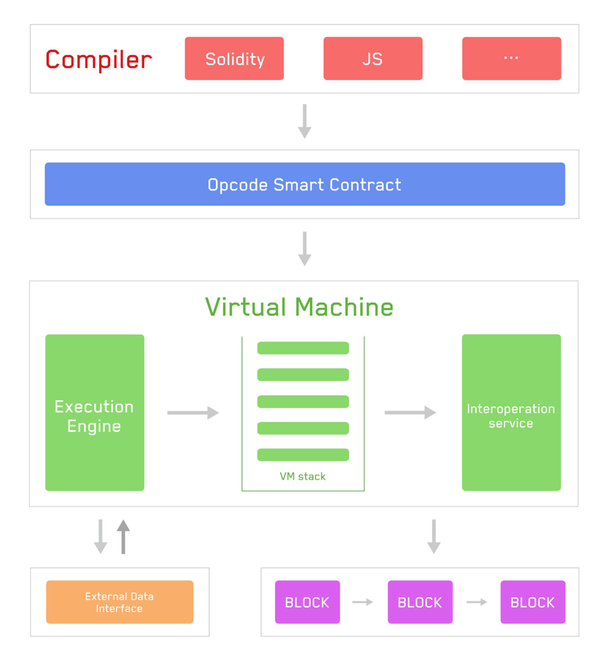

# 波场虚拟机（TVM）
***
TVM是波场智能合约的运行环境，网络中的每个节点都维护着一个 TVM 实体。
波场协议保持着这个状态机的持续、不间断和不可更改的运行。
在链上的任何给定区块中，波场都有且仅有一个 "`canonical`" 状态，TVM 定义了在区块间计算新有效状态的规则。

## 从账本到状态机
`分布式账本`这一比喻经常被用来描述像比特币这样的区块链，它利用密码学的基本工具实现了一种去中心化的货币。
加密货币的行为与`普通`货币类似，因为其规则规定了人们可以和不可以修改分类账的行为。
例如，一个比特币地址花费的比特币不能超过它之前收到的比特币。这些规则是比特币所有交易的基础。

## 状态转换函数
TVM 的行为就像数学函数一样： 给定一个输入，它就会产生一个确定的输出。
因此，将波场更正式地描述为具有状态转换函数是非常有用的：

!!! quote ""
    Y(S, T) = S'

给定一个旧的有效状态（S）和一组新的有效事务（T），波场状态转换函数 Y（S，T）会产生一个新的有效输出状态 S'。

### 状态
在波场网络中，状态是一个名为 Merkle Trie 的巨大数据结构，它通过哈希值将所有账户联系起来，并可还原为存储在区块链上的单一根哈希值。

### 交易
交易是来自账户的加密签名指令。交易分为系统合约交易和智能合约交易两类，其中智能合约交易包括调用合约信息的交易和创建合约的交易。

创建合约会创建一个新的合约账户，其中包含编译好的智能合约字节码。每当其他账户对该合约进行消息调用时，就会在 TVM 中执行其字节码。

## TVM 介绍
EVM 以堆栈机的形式执行，深度为 1024 项。每个项都是一个 256 位字，这样选择是为了便于使用 256 位加密技术（如 Keccak-256 哈希值或 secp256k1 签名）。

编译后的智能合约字节码以大量 EVM 操作码的形式执行，执行 XOR、AND、ADD、SUB 等标准堆栈操作。
EVM 还实现了一些特定于区块链的堆栈操作，如 ADDRESS、BALANCE、BLOCKHASH 等。
更多操作码请参阅 [波场操作码](https://github.com/tronprotocol/java-tron/blob/develop/actuator/src/main/java/org/tron/core/vm/Op.java)

下面的流程图显示了 TVM 的工作原理：

具体流程如下：

- 编译器将智能合约编译成可在 TVM 上读取和执行的字节码。
- TVM 通过操作码处理数据。
- TVM 通过互操作层访问区块链数据并调用外部数据接口。
- TVM 执行完毕后，状态会被写入块中，用户可以通过 API 查询执行结果和状态。

## 与 EVM 的区别
**TVM 基本上与 EVM 兼容，只是在细节上有些不同**

- TVM 使用`能量`而不是 `gas`。目前能源价格为 `210sun`，`GASPRICE`, `BASEFEE` 返回 TVM 中的能量单价。
- 在 TVM 中，`DIFFICULTY` 和 `GASLIMIT` 返回 0
- TVM 中的大多数操作码的能耗与 EVM 中的操作码的能耗相当，其中一些操作码的能耗较低（如 `SLOAD`、`CALL`）。
- `CREATE2` 创建的合同地址前缀与 EVM 不同： TVM 选择 `0x41` 作为前缀，计算公式为 `keccak256( 0x41 ++ address ++ salt ++ keccak256(init_code))[12:]`
- 预编译合约 `Ripemd160(0x03)`： TVM 对输入进行两次 SHA-256 计算。将有一个新的预编译合约来实现标准的 `Ripemd160`
- 预编译合同 `0x09`：EVM 在此地址上有 `Blake2F`；在 TVM 上是 `BatchValidateSign`。参见 [TIP-43](https://github.com/tronprotocol/tips/blob/master/tip-43.md)
- 向合约发送 TRX 有两种方法： 转账和带有 `callValue` 的触发智能合约。转账不会调用合约中的后备函数

**TVM 具有基于波场特性的新功能**

- TRC-10 相关操作码： `CALLTOKEN(0xd0)`、`TOKENBALANCE(0xd1)`、`CALLTOKENVALUE(0xd2)` 和 `CALLTOKENID(0xd3)`
- 判断地址是否属于合约： `ISCONTRACT(0xd4)` [TIP-44](https://github.com/tronprotocol/tips/blob/master/tip-44.md)
- 批量验证普通签名和多重签名： `BatchValidateSign(0x09)` [TIP-43](https://github.com/tronprotocol/tips/blob/master/tip-43.md), `ValidateMultiSign(0x0a)` [TIP-60](https://github.com/tronprotocol/tips/blob/master/tip-60.md)
- 匿名合约和 `Librustzcash` 相关预编译合约：`verifyMintProof(0x1000001)`、`verifyMintProof(0x1000002)`、`verifyMintProof(0x1000003)` 和 `merkleHash(0x1000004)`。参见 TIP-135、TIP-137 和 TIP-138。
- 冻结/解冻功能： `FREEZE(0xd5)`、`UNFREEZE(0xd6)` 和 `FREEZEEXPIRETIME(0xd7)`。请参见 TIP-157。
- 与合约表决相关的操作码和预编译合约： `VOTEWITNESS(0xd8)`、`WITHDRAWREWARD(0xd9)`、`RewardBalance(0x1000006)`、`IsSrCandidate(0x1000006)`、`VoteCount(0x1000007)`、`UsedVoteCount(0x1000008)`、`ReceivedVoteCount(0x1000009)` 和 `TotalVoteCount(0x100000a)`。请参见 TIP-271。
- 与 Stake 2.0 相关的冻结/解冻/委托/解除委托函数： `FREEZEBALANCEV2(0xda)`, `UNFREEZEBALANCEV2(0xdb)`, `CANCELALLUNFREEZEV2(0xdc)`, `WITHDRAWEXPIREUNFREEZE(0xdd)`, `DELEGATERESOURCE(0xde)`、 和 `GetChainParameter(0x100000b)`、`AvailableUnfreezeV2Size(0x100000c)`、`UnfreezableBalanceV2(0x100000d)`、 `ExpireUnfreezeBalanceV2(0x100000e)`, `DelegatableResource(0x100000f)`, `ResourceV2(0x1000010)`, `CheckUnDelegateResource(0x1000011)`, `ResourceUsage(0x1000012)`, `TotalResource(0x1000013)`, `TotalDelegatedResource(0x1000014)`, `TotalAcquiredResource(0x1000015)`. 请参见 TIP-467。

兼容解决方案目前正在讨论中，如果您感兴趣，请转到 GitHub ISSUE 参与讨论。

[ISSUE-272](https://github.com/tronprotocol/tips/issues/272)

[TIP-272](https://github.com/tronprotocol/tips/blob/master/tip-272.md)

